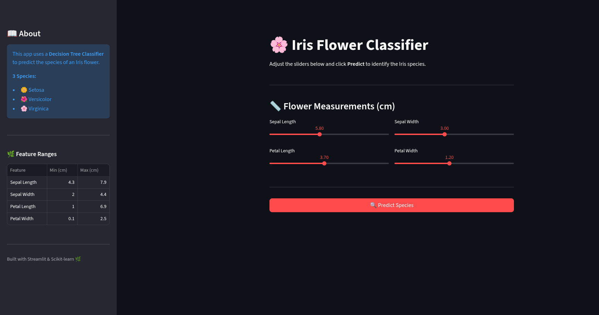
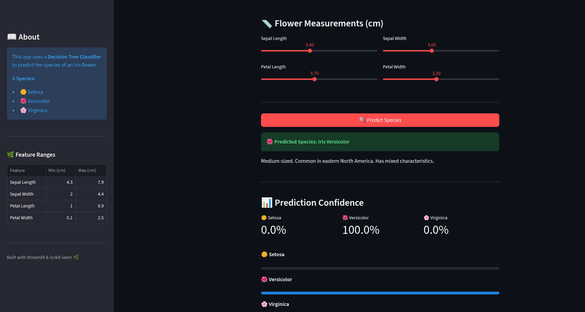
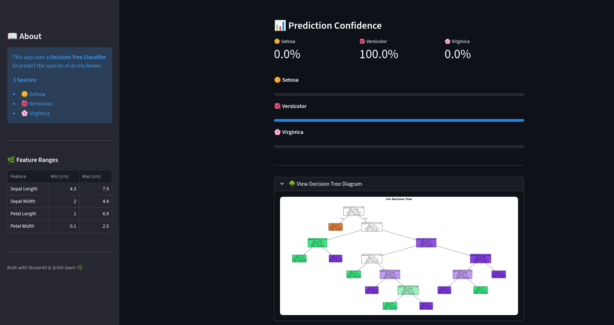
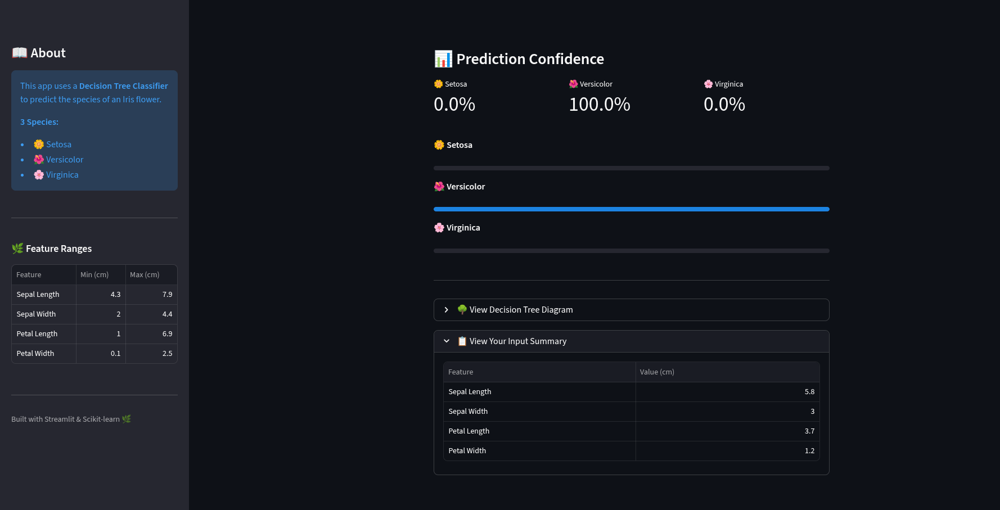

# 🌸 Iris Flower Species Classifier

A machine learning web application that predicts the species of an Iris flower using a **Decision Tree Classifier**, built with Python and deployed via Streamlit.


---

## 🚀 Live Demo

[Iris Flower Species Classifier - Iris Lens](https://iris-lens.streamlit.app/)
---
## ScreenShots
* git 
* 
* 
* 
---
## 📌 About

This app takes four flower measurements as input and predicts which of the three Iris species the flower belongs to:

| Species | Description |
|---------|-------------|
| 🌼 Setosa | Small & hardy, found in Arctic regions |
| 🌺 Versicolor | Medium-sized, common in eastern North America |
| 🌸 Virginica | Large & striking, found in eastern US wetlands |

---

## 🧠 Model Details

| Property | Value |
|----------|-------|
| Algorithm | Decision Tree Classifier |
| Dataset | Iris Dataset (sklearn built-in) |
| Train/Test Split | 70% / 30% |
| Model Accuracy | **97%** |
| Features Used | Sepal Length, Sepal Width, Petal Length, Petal Width |

---

## 🖥️ Features

- 🎚️ Interactive sliders for real-time input
- ✅ Instant species prediction with confidence score
- 📊 Probability breakdown for all three species
- 🌳 Visual Decision Tree diagram
- 📋 Input summary table

---

## 📁 Project Structure

```
iris-flower-classifier/
├── app.py               # Streamlit web application
├── save_model.py        # Script to train and save the model
├── iris_model.pkl       # Pre-trained Decision Tree model
├── requirements.txt     # Python dependencies
└── README.md            # Project documentation
```

---

## ⚙️ Run Locally

**1. Clone the repository**
```bash
git clone https://github.com/chaudhary-hadi27/iris-flower-classifier.git
cd iris-flower-classifier
```

**2. Install dependencies**
```bash
pip install -r requirements.txt
```

**3. Train and save the model**
```bash
python save_model.py
```

**4. Run the app**
```bash
streamlit run app.py
```

---

## 📦 Dataset

The **Iris Dataset** is one of the most well-known datasets in machine learning, originally introduced by statistician Ronald Fisher in 1936. It contains 150 samples across 3 species with 4 features each.

---

## 🛠️ Built With

- [Python](https://www.python.org/)
- [Streamlit](https://streamlit.io/)
- [Scikit-learn](https://scikit-learn.org/)
- [Matplotlib](https://matplotlib.org/)
- [NumPy](https://numpy.org/)

---

## 👤 Author

**Your Name**
- GitHub: [@chaudhary-hadi27](https://github.com/chaudhary-hadi27)
- X: [@ChaudharyHadi27](https://x.com/ChaudharyHadi27)

---

## 📄 License

This project is licensed under the MIT License.# iris-flower-classifier
